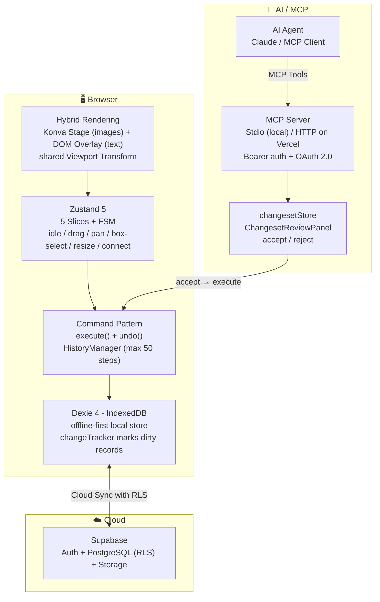

# Serenity Canvas

An elegant open-source visual whiteboard for the web — a browser-based alternative to [Obsidian Canvas](https://obsidian.md/canvas).

- 🎨 Infinite canvas with text cards, image cards, connections, and groups
- 📦 Offline-first — all data stored locally via IndexedDB, no network required
- ☁️ Optional cloud sync with Supabase authentication and real-time persistence
- 🤖 AI-powered canvas editing via MCP server with changeset review UI

&nbsp;&nbsp;

## Tech Stack

&nbsp;

## Architecture

&nbsp;&nbsp;

## Phase 0 — Core Canvas

### Canvas Functionality

| Component   | Feature             | Description                                                                       |
| ----------- | ------------------- | --------------------------------------------------------------------------------- |
| 🌐 Frontend | Infinite Canvas     | Freely pan and zoom across an unbounded workspace                                 |
| 🌐 Frontend | Text Cards          | Rich text editing powered by Tiptap with full Markdown support and Slash Commands |
| 🌐 Frontend | Image Cards         | Drag-and-drop or paste images with automatic Web Worker compression (WebP ≤ 1 MB) |
| 🌐 Frontend | Card Connections    | Draw edges between cards with labels, direction arrows, and multiple line styles  |
| 🌐 Frontend | Color Tagging       | Six preset colors compatible with Obsidian Canvas format                          |
| 🌐 Frontend | Undo / Redo         | Full Command Pattern history up to 50 steps                                       |
| 🌐 Frontend | Grouping            | Visual grouping of cards with independent z-order management                      |
| 🌐 Frontend | Keyboard Navigation | Comprehensive shortcuts designed for power users                                  |
| 🌐 Frontend | Hybrid Rendering    | Image nodes on Konva Canvas; text nodes as DOM overlays synced to viewport        |

&nbsp;&nbsp;

## Phase 1 — Offline-First Storage

### Storage Functionality

| Component   | Feature               | Description                                                                                    |
| ----------- | --------------------- | ---------------------------------------------------------------------------------------------- |
| 🌐 Frontend | IndexedDB Persistence | All boards, nodes, edges, and groups persisted locally via Dexie                               |
| 🌐 Frontend | Image Asset Cache     | Compressed images stored in IndexedDB with ref-counted Object URL cache                        |
| 🌐 Frontend | Import / Export       | Export canvas to ZIP (Obsidian-compatible format) via JSZip                                    |
| 🌐 Frontend | Finite State Machine  | Interaction modes (idle, dragging, panning, box-selecting, resizing, connecting) driven by FSM |
| 🌐 Frontend | Dirty Change Tracking | `changeTracker.ts` records which records have been modified since last sync                    |

&nbsp;&nbsp;

## Phase 2 — Cloud Sync & Authentication

### Sync Functionality

| Component   | Feature                 | Description                                                            |
| ----------- | ----------------------- | ---------------------------------------------------------------------- |
| 🌐 Frontend | User Authentication     | Sign in / sign up with Supabase Auth                                   |
| 🌐 Frontend | Cloud Sync              | Real-time sync of boards, nodes, and edges to Supabase PostgreSQL      |
| 🌐 Frontend | Local → Cloud Migration | One-time dialog migrates local data to the cloud on first login        |
| 🌐 Frontend | Sync Status Indicator   | Visual indicator showing syncing, offline, error, and synced states    |
| 🖥️ Backend  | Row Level Security      | All Supabase tables protected by RLS; users only access their own data |
| 🖥️ Backend  | Database Migrations     | Version-controlled schema via Supabase CLI migration files             |

&nbsp;&nbsp;

## Phase 3 — AI / MCP Integration

### AI Functionality

| Component   | Feature              | Description                                                                         |
| ----------- | -------------------- | ----------------------------------------------------------------------------------- |
| 🌐 Frontend | Changeset Review UI  | Accept or reject AI-generated canvas edits card-by-card via `ChangesetReviewPanel`  |
| 🌐 Frontend | Pending Node Overlay | Visual overlay highlights nodes that are awaiting AI modification                   |
| 🖥️ Backend  | MCP Server (Stdio)   | Local MCP server exposing board, node, edge, and changeset tools to AI agents       |
| 🖥️ Backend  | MCP HTTP API         | Vercel serverless endpoint with Bearer auth and 60 req/min rate limiting            |
| 🖥️ Backend  | OAuth 2.0            | Full OAuth server for MCP client authorization (authorize / callback / token flows) |

&nbsp;&nbsp;
