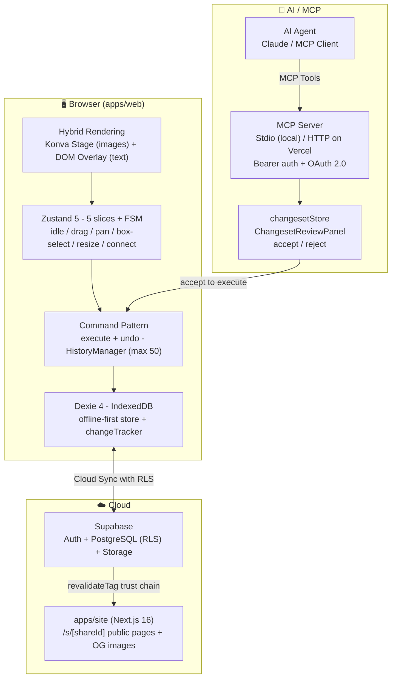

# Serenity Canvas

An elegant open-source visual whiteboard for the web — a browser-based alternative to [Obsidian Canvas](https://obsidian.md/canvas).

- 🎨 Infinite canvas with text cards, image cards, connections, and groups
- 📦 Offline-first — all data stored locally via IndexedDB, no network required
- ☁️ Optional cloud sync with Supabase authentication and real-time persistence
- 🔗 Public sharing — publish read-only boards to a Next.js site with dynamic OG images
- 🤖 AI-powered canvas editing via MCP server with changeset review UI

## Product Preview


## Why Serenity Canvas?

When CLI AI tools edit an Obsidian Canvas, they write directly to a JSON file where every card carries fixed coordinates and dimensions. The AI has no feedback loop on how content actually renders, so generated boards end up with overflowing or oversized cards, overlapping nodes, and awkward spacing — leaving you to manually clean up layout before the result is readable.

Serenity Canvas is an MCP-compatible, AI-native infinite canvas built to remove that cleanup cost:

- **Auto-sizing text cards** — text nodes render as DOM overlays that size themselves to their content, so AI no longer has to guess pixel-perfect dimensions.
- **Konva-powered canvas** — image rendering, panning, zooming, and connection drawing run on a Konva Stage for smooth interaction at scale.
- **Readable AI output** — the combination makes AI-generated whiteboards easy to read, adjust, and extend instead of something you have to repair by hand.

## Engineering Highlights

- **Offline-first local model** — boards, nodes, edges, groups, and image assets persist in IndexedDB, so the app remains usable without a network.
- **Hybrid rendering** — image nodes and edge visuals render on Konva, while rich text cards render as DOM overlays synced to canvas coordinates.
- **Command-based mutations** — undoable changes flow through `Command` objects and a bounded `HistoryManager`.
- **Optional cloud sync** — Supabase Auth, PostgreSQL, Storage, RLS, and dirty-change tracking support local-to-cloud persistence.
- **AI review flow** — MCP changes arrive as changesets that users can accept or reject before edits are applied.
- **Public sharing** — boards can be published as read-only pages with dynamic Open Graph images and tag-based revalidation.

## Tech Stack


| Capability       | Key technologies                                                   |
| ---------------- | ------------------------------------------------------------------ |
| Web app          | React 19, TypeScript 5.9, Vite 7, React Router 7                   |
| Canvas/editor    | Zustand 5, Tiptap 2, Konva + react-konva, Tailwind 4, shadcn/ui    |
| Local data       | Dexie 4, IndexedDB, JSZip, Web Worker image compression            |
| Cloud and share  | Supabase, Vercel API routes, Next.js 16, `@supabase/ssr`           |
| AI integration   | MCP Stdio server, HTTP MCP endpoint, OAuth 2.0, Zod                |
| Testing/tooling  | Turborepo, pnpm 9, Vitest 4, Testing Library, Playwright, ESLint   |
| Shared contracts | `@serenity/shared`, domain serializers, edge utilities, DB typings |

## Monorepo Structure

| Package                | Path               | Description                                 |
| ---------------------- | ------------------ | ------------------------------------------- |
| `web`                  | `apps/web/`        | Main React SPA (Vite) + Vercel API routes   |
| `site`                 | `apps/site/`       | Public share / marketing pages (Next.js 16) |
| `@serenity/mcp-server` | `apps/mcp-server/` | MCP Stdio server for AI editing             |
| `@serenity/shared`     | `packages/shared/` | Shared types, serializers, edge utils       |

## Getting Started

### Prerequisites

- Node.js (LTS)
- pnpm `9.6.0` (`corepack enable`)
- Docker (for local Supabase)

### Setup

```bash
pnpm install
cp .env.example .env            # fill in local values
pnpm db:start                   # start local Supabase (Docker)
pnpm db:reset                   # apply migrations + seed
pnpm dev                        # apps/web :5173 + apps/site :3000
```

Local dev login: `test@example.com` / `password123`

Environment variables are grouped in `.env.example`:

- `apps/web` (browser): `VITE_*`
- `apps/web/api` (Vercel serverless, server-only): `SUPABASE_*`, `CRON_SECRET`, `REVALIDATE_SECRET`
- `apps/site` (Next.js): `NEXT_PUBLIC_*`, `REVALIDATE_SECRET`

## System Architecture


```mermaid
flowchart TB
    subgraph browser["🖥️ Browser (apps/web)"]
        Rendering["Hybrid Rendering<br>Konva Stage (images) + DOM Overlay (text)"]
        State["Zustand 5 - 5 slices + FSM<br>idle / drag / pan / box-select / resize / connect"]
        Commands["Command Pattern<br>execute + undo - HistoryManager (max 50)"]
        Dexie["Dexie 4 - IndexedDB<br>offline-first store + changeTracker"]
    end

    subgraph cloud["☁️ Cloud"]
        Supabase["Supabase<br>Auth + PostgreSQL (RLS) + Storage"]
        Site["apps/site (Next.js 16)<br>/s/[shareId] public pages + OG images"]
    end

    subgraph aiMcp["🤖 AI / MCP"]
        Agent["AI Agent<br>Claude / MCP Client"]
        MCPServer["MCP Server<br>Stdio (local) / HTTP on Vercel<br>Bearer auth + OAuth 2.0"]
        Changeset["changesetStore<br>ChangesetReviewPanel<br>accept / reject"]
    end

    Rendering --> State
    State --> Commands
    Commands --> Dexie
    Dexie <-->|"Cloud Sync with RLS"| Supabase
    Supabase -->|"revalidateTag trust chain"| Site
    Agent -->|"MCP Tools"| MCPServer
    MCPServer --> Changeset
    Changeset -->|"accept to execute"| Commands
```

## Commands

```bash
# Dev / build (Turborepo - all workspaces)
pnpm dev          # apps/web (Vite) + apps/site (Next.js)
pnpm build        # build all workspaces
pnpm typecheck    # typecheck all workspaces
pnpm lint
pnpm test         # unit tests (Vitest)

# Web-specific
pnpm e2e          # Playwright E2E (apps/web)
pnpm -C apps/web dev

# MCP server
pnpm mcp:dev      # run MCP server locally (tsx)
pnpm build:mcp    # compile → apps/mcp-server/dist/

# Database (delegates to apps/web Supabase CLI)
pnpm db:start     # start local Supabase
pnpm db:stop      # stop local Supabase
pnpm db:reset     # apply migrations + seed
pnpm db:migration:new <name>
pnpm db:types     # regenerate → packages/shared/src/types/supabase.ts
pnpm db:push      # push migrations to production
```

## Features

### Core Canvas

| Feature          | Description                                                         |
| ---------------- | ------------------------------------------------------------------- |
| Infinite Canvas  | Freely pan and zoom across an unbounded workspace                   |
| Text Cards       | Rich text via Tiptap with Markdown support and slash commands       |
| Image Cards      | Drag-and-drop / paste with Web Worker compression (WebP ≤ 1 MB)     |
| Card Connections | Edges with labels, direction arrows, and multiple line styles       |
| Color Tagging    | Six Obsidian-compatible preset colors                               |
| Grouping         | Visual grouping of cards with independent z-order management        |
| Undo / Redo      | Full Command Pattern history up to 50 steps                         |
| Hybrid Rendering | Image nodes on Konva; text nodes as DOM overlays synced to viewport |
| i18n             | zh-TW (default) + en — all UI text via i18next                      |

### Offline-First Storage

| Feature               | Description                                                      |
| --------------------- | ---------------------------------------------------------------- |
| IndexedDB Persistence | Boards, nodes, edges, and groups persisted locally via Dexie     |
| Image Asset Cache     | Compressed images in IndexedDB with ref-counted Object URL cache |
| Import / Export       | Export canvas to ZIP (Obsidian-compatible format) via JSZip      |
| Dirty Change Tracking | `changeTracker.ts` records which records changed since last sync |

### Cloud Sync & Authentication

| Feature                 | Description                                                      |
| ----------------------- | ---------------------------------------------------------------- |
| User Authentication     | Sign in / sign up with Supabase Auth                             |
| Cloud Sync              | Sync of boards, nodes, and edges to Supabase PostgreSQL          |
| Local → Cloud Migration | One-time dialog migrates local data to the cloud on first login  |
| Sync Status Indicator   | Visual indicator for syncing, offline, error, and synced states  |
| Row Level Security      | All Supabase tables protected by RLS; users access only own data |

### Sharing & Public Pages

| Feature                | Description                                                               |
| ---------------------- | ------------------------------------------------------------------------- |
| Public Share Pages     | Read-only boards served at `/s/[shareId]` (apps/site, Next.js)            |
| Dynamic OG Images      | Per-board Open Graph images generated via `api/og/[shareId]`              |
| Revalidate Trust Chain | 2-stage: Bearer + RLS owner check → `REVALIDATE_SECRET` → `revalidateTag` |

### AI / MCP Integration

| Feature              | Description                                                                   |
| -------------------- | ----------------------------------------------------------------------------- |
| Changeset Review UI  | Accept or reject AI-generated edits card-by-card via `ChangesetReviewPanel`   |
| Pending Node Overlay | Visual overlay highlights nodes awaiting AI modification                      |
| MCP Server (Stdio)   | Exposes board, node, edge, and changeset tools to AI agents                   |
| MCP HTTP API         | Vercel serverless endpoint with Bearer auth and 60 req/min rate limiting      |
| OAuth 2.0            | Full OAuth server for MCP client authorization (authorize / callback / token) |

## Database & Migrations

Schema changes must go through migration files — never edit Supabase Studio directly.

```
pnpm db:migration:new <name> → edit SQL → pnpm db:reset → pnpm db:types → pnpm typecheck → commit
```

Deploy: `pnpm db:push` (migrations first), then deploy code.

## Testing

- **Unit**: Vitest 4 + Testing Library, `fake-indexeddb` for IndexedDB, AAA pattern in `__tests__/`
- **E2E**: Playwright with the `CanvasPage` POM fixture (`apps/web/e2e/`)

## CI / Security

- `ci.yml` — Docker-based pipeline: `pnpm audit` → lint → typecheck → test → build → upload artifacts
- `security.yml` — scheduled security scanning
- Dependabot + gitleaks for dependency and secret hygiene

## MCP Integration

Add the local Stdio server to your MCP client (e.g. Claude Desktop). Use an absolute package path unless your MCP client is guaranteed to run from the repository root:

```jsonc
{
  "mcpServers": {
    "serenity-canvas": {
      "command": "pnpm",
      "args": [
        "-C",
        "/absolute/path/to/serenity-canvas/apps/mcp-server",
        "dev",
      ],
    },
  },
}
```

When launching from the repository root, the relative path also works: `["-C", "apps/mcp-server", "dev"]`.

The HTTP variant (`apps/web/api/mcp.ts`) is deployed on Vercel and uses Bearer auth / OAuth 2.0.

## License

[MIT](./LICENSE)
